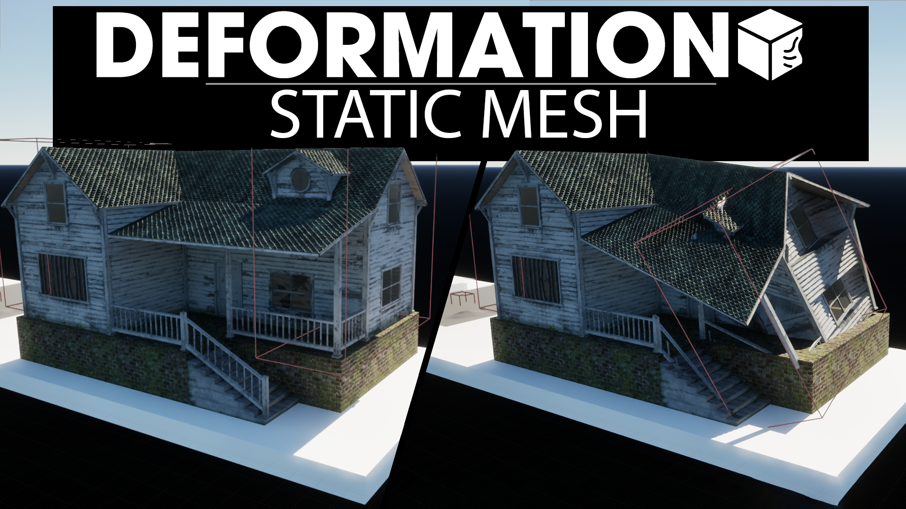

# Hello!
open LVL_Examples to test plugin out

## How to set up:
  1.Select your meshes material and open it in material editor.
  
  2.Add material function and select collectionDeformation function.
  
  3.Use "getMaterialAttributes" node top get "normal" and "worldPositionOprion" of function and connect it to normal and worldPositionOffset. If you want to use your own normal map use "blendAngleCorrectedNormals" to use both.
  
  you can see how final result should look like here 
  
  unfortunatly you have to do this for every material you want to be deformable.

## important functions:
 ### BP_DEFORMER Funciotns:
   -resetDeformer: used to reset static parameters of material, therefore resetting all the deformations by the deformer
   -updateAllStartParameters: Same but will not be adding any new targets
  ### BP_GLOBALDEFORMERSOLVER Funciotns:
   -updateGlobalIds: updating the IDs of deformers. Important if any old deformers were removed or if you have added new targets to the deformer mid-game.
  ### important info:
   -Deformation targets will ignore all the deformation done by deformers whose names are in target component tags. Used for excluding the deformer from deforming one of the meshes inside bp
  The tag "ignore" will make mesh ignorable to deformers of this blueprint.

This plugin consists of a basic deformation system, working by sending real-time data to shaders through material collections and static parameters by rendering target. It can be used to create soft objects like trees, cars etc. or deform static meshes like landscape deformation or realistic destruction.
